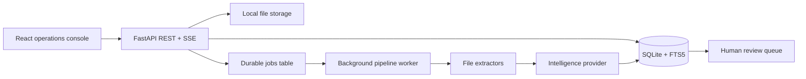

# DocuFlux — AI Document Pipeline

[](https://github.com/dragon122177/ai-document-pipeline/actions/workflows/ci.yml)

DocuFlux is a secure document-operations workspace that turns unstructured
business files into reviewable, searchable, structured data. It combines a
FastAPI processing service, durable SQLite storage, a background pipeline,
human approvals, role-based access, realtime events, and a responsive React
console.

The default intelligence engine is local and deterministic, so the complete
demo works without paid AI credentials. A provider-neutral adapter can send
the same contract to a private remote model endpoint when required.


## What it demonstrates

- Ingestion for PDF, DOCX, TXT, Markdown, CSV, and JSON files
- Content hashing, duplicate protection, and idempotent job creation
- Classification for invoices, contracts, resumes, financial reports, and
  general documents
- Extractive summaries, keywords, entity detection, structured fields, and
  confidence scoring
- Sensitive-data detection and a separate redacted preview
- Multi-stage background processing with progress events and bounded retries
- Human review for low-confidence output or high-risk clauses
- Reviewer corrections, approval/rejection decisions, and audit history
- SQLite FTS5 full-text search over processed content
- PBKDF2 password hashing, signed bearer tokens, and role-based permissions
- Server-Sent Events for live pipeline updates
- Docker Compose, GitHub Actions, automated tests, and fictional seed data

## Product tour

The React application provides six operational surfaces:

1. **Overview** — pipeline metrics, recent documents, categories, active jobs,
   and review work.
2. **Documents** — filters, source metadata, extraction details, redacted text,
   risks, and job history.
3. **Review queue** — side-by-side source and JSON field correction before a
   governed decision.
4. **Knowledge search** — ranked full-text retrieval across indexed content.
5. **Templates** — explicit output schemas for every supported business type.
6. **Audit trail** — actor, action, target, timestamp, and structured context.

## Architecture



The default worker runs in the API process for a zero-infrastructure demo.
Production evolution would move the same job contract to a dedicated queue and
worker service. See [`docs/ARCHITECTURE.md`](docs/ARCHITECTURE.md) for the
detailed flow and trade-offs.

## Run locally

Requirements: Python 3.12+, Node.js 22+, and npm.

```bash
python -m venv .venv
source .venv/bin/activate
pip install -r requirements.txt

cd frontend
npm install
cd ..
```

Start the API:

```bash
PYTHONPATH=backend uvicorn app.main:app --reload --port 8000
```

In a second terminal, start the web application:

```bash
cd frontend
npm run dev
```

Open [http://localhost:5174](http://localhost:5174). Interactive API
documentation is generated by FastAPI at
[http://localhost:8000/docs](http://localhost:8000/docs).

### Demo accounts

| Role | Email | Password | Main permission |
|---|---|---|---|
| Admin | `admin@docuflux.demo` | `demo1234` | Full workspace and audit access |
| Analyst | `analyst@docuflux.demo` | `demo1234` | Ingest and reprocess documents |
| Reviewer | `reviewer@docuflux.demo` | `demo1234` | Approve, reject, and correct output |

All bundled people, companies, files, and credentials are fictional.

## Run with Docker

```bash
docker compose up --build
```

Open [http://localhost:8080](http://localhost:8080). The API remains available
on port `8000`, and the named volume `docuflux-data` retains the database and
uploads between container restarts.

## Try the pipeline

Use **Ingest document** in the interface and select one of the files under
`samples/`:

- `samples/invoice.txt` completes automatically with invoice fields.
- `samples/contract.txt` enters human review because it contains unlimited
  liability and automatic-renewal language.
- `samples/quarterly-report.json` becomes a searchable financial report.

A scanned image-only PDF returns the explicit `ocr_required` error. This
repository does not claim OCR that it does not implement.

## Key files

| File | Responsibility |
|---|---|
| `backend/app/main.py` | Application factory, middleware, health endpoint, and route registration |
| `backend/app/pipeline.py` | Job claiming, processing stages, retries, indexing, and review routing |
| `backend/app/intelligence.py` | Provider contract, local analysis engine, remote adapter, and redaction |
| `backend/app/schema.sql` | Relational tables, constraints, indexes, and FTS5 index |
| `backend/app/api/documents.py` | Upload, pasted text, listing, export, and reprocessing endpoints |
| `backend/app/api/reviews.py` | Human review queue and governed decisions |
| `frontend/src/App.tsx` | Protected routes and role-aware page composition |
| `frontend/src/components/DocumentDrawer.tsx` | Complete extraction and timeline inspector |
| `frontend/src/pages/ReviewPage.tsx` | Side-by-side correction and approval workspace |
| `.github/workflows/ci.yml` | Backend, frontend, and container validation |
| `compose.yaml` | Reproducible API and web deployment |

The complete annotated map is in [`docs/FILE_MAP.md`](docs/FILE_MAP.md).

## Tests

```bash
# Backend
.venv/bin/python -m pytest --cov=backend/app --cov-report=term

# Frontend
cd frontend
npm run typecheck
npm test
npm run build
```

The suite covers authentication, authorization, idempotency, classification,
field extraction, PII redaction, chunking, review routing, reviewer
corrections, upload validation, search, export, dashboard metrics, UI states,
and formatting helpers.

## Configuration

Copy `.env.example` to `.env` and set values in your shell or deployment
platform. Important options:

| Variable | Default | Purpose |
|---|---|---|
| `TOKEN_SECRET` | Development-only value | Signs access tokens |
| `DATABASE_PATH` | `.data/docuflux.db` | Durable SQLite location |
| `UPLOAD_DIRECTORY` | `.data/uploads` | Local object-storage adapter path |
| `MAX_UPLOAD_MB` | `12` | Per-file size boundary |
| `PIPELINE_WORKER_ENABLED` | `true` | Starts the in-process worker |
| `PIPELINE_STAGE_DELAY` | `0.12` | Makes demo progress visible |
| `REMOTE_AI_URL` | unset | Enables a private JSON intelligence provider |
| `REMOTE_AI_TOKEN` | unset | Optional bearer token for that provider |

## Security and production notes

The repository applies input boundaries, extension allow-listing, safe file
names, content hashing, parameterized SQL, password hashing, signed token
expiration, least-privilege roles, safe redacted previews, and audit records.

Before processing real regulated documents, replace demo identities, use a
managed identity provider, encrypt storage, add malware scanning and isolated
OCR, rotate secrets, define retention rules, and deploy the worker separately.
See [`SECURITY.md`](SECURITY.md).

## Documentation

- [`docs/ARCHITECTURE.md`](docs/ARCHITECTURE.md) — components, lifecycle, and
  scale-out plan
- [`docs/API.md`](docs/API.md) — endpoint and permission reference
- [`docs/FILE_MAP.md`](docs/FILE_MAP.md) — every important file explained
- [`docs/DEMO_SCRIPT.md`](docs/DEMO_SCRIPT.md) — a focused interview demo
- [`docs/DECISIONS.md`](docs/DECISIONS.md) — engineering choices and honest
  trade-offs

## License

MIT — see [`LICENSE`](LICENSE).
