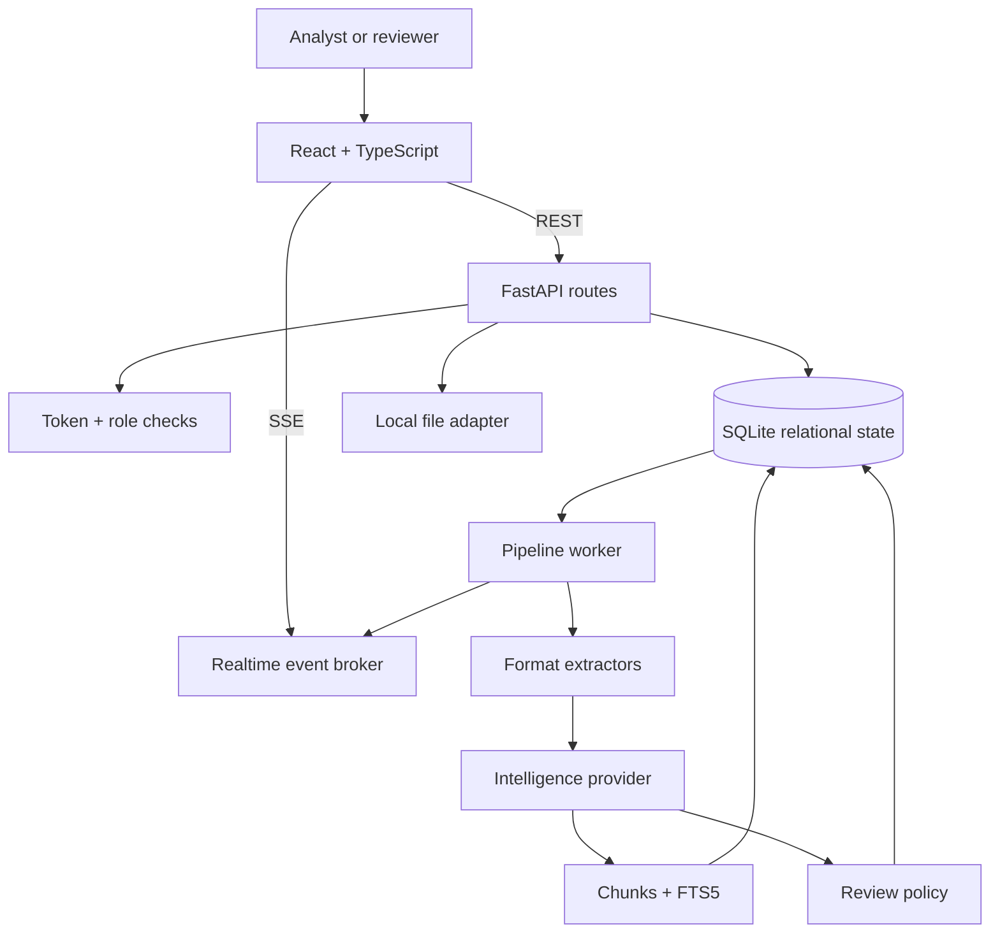
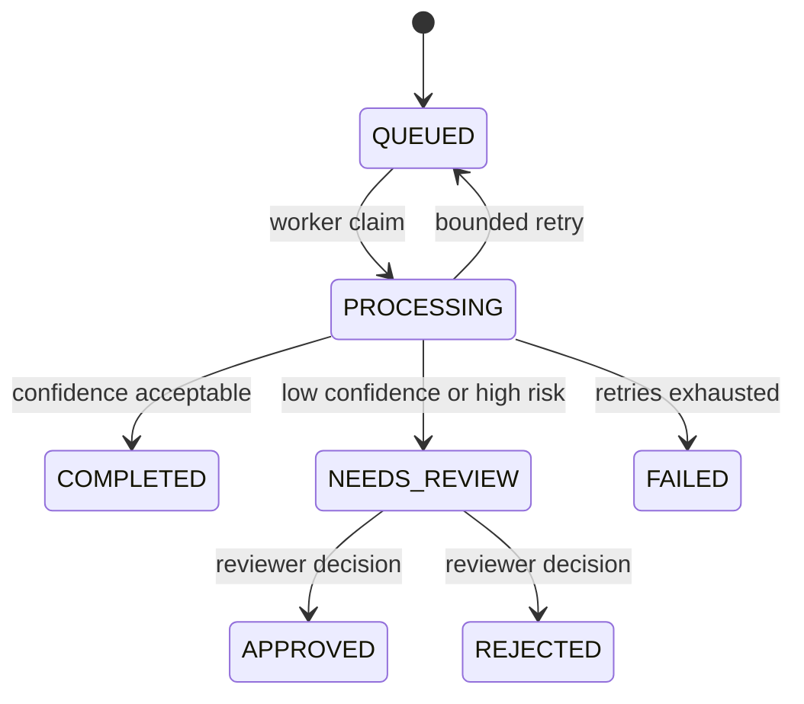

# Architecture

## System context

DocuFlux separates the user-facing console, HTTP boundary, durable state,
binary storage, document intelligence, and human decisions. The interfaces are
small enough to run locally but explicit enough to replace in production.

## Processing lifecycle

The authoritative lifecycle is implemented in `backend/app/pipeline.py`.

Each run emits these observable stages:

| Stage | Progress | Responsibility |
|---|---:|---|
| `INGESTION` | 12% | Resolve source text and page count |
| `CLASSIFICATION` | 32% | Select the document category |
| `EXTRACTION` | 55% | Produce entities and typed fields |
| `REDACTION` | 72% | Create a safe preview without modifying source |
| `INDEXING` | 86% | Chunk content and refresh FTS5 |
| `VALIDATION` | 100% | Complete or route to human review |

## Persistence

`backend/app/schema.sql` defines:

- `documents` for source metadata and latest intelligence output
- `jobs` and `job_events` for durable orchestration and observability
- `reviews` for human decisions and corrections
- `chunks` and `document_fts` for retrieval
- `templates` for output contracts
- `audit_events` for security-relevant activity
- `users` for the self-contained demo identity store

SQLite uses WAL mode and short-lived connections. A job claim executes inside
`BEGIN IMMEDIATE`, which prevents two local worker threads from claiming the
same queued record.

## Intelligence provider boundary

`backend/app/intelligence.py` defines `DocumentIntelligenceProvider`. The local
implementation provides deterministic classification, extraction, summaries,
keywords, risk rules, and confidence without a network dependency.

`RemoteJsonProvider` shows the integration boundary for a private model
gateway. It sends `{ "title": "...", "text": "..." }` and expects the same
fields as `AnalysisResult`. Authentication and provider-specific prompt
management remain outside the core pipeline.

## Review policy

A document enters review when:

- extraction confidence is below `0.78`, or
- at least one risk signal has severity `HIGH`.

`frontend/src/pages/ReviewPage.tsx` displays redacted source text and extracted
JSON side by side. Corrections are merged into the document only when a
reviewer approves or rejects the pending review. The decision is audited.

## Scale-out path

The demo intentionally minimizes infrastructure. A production evolution would:

1. Replace `LocalFileStorage` with encrypted object storage.
2. Replace SQLite with PostgreSQL and a dedicated search service if needed.
3. Publish job IDs to a managed queue instead of polling the jobs table.
4. Run extraction/OCR in isolated, autoscaled workers.
5. Move the in-memory event broker to a shared pub/sub service.
6. Replace demo auth with OIDC and organization-level policy.

The API contracts and state machine can remain stable through those changes.
